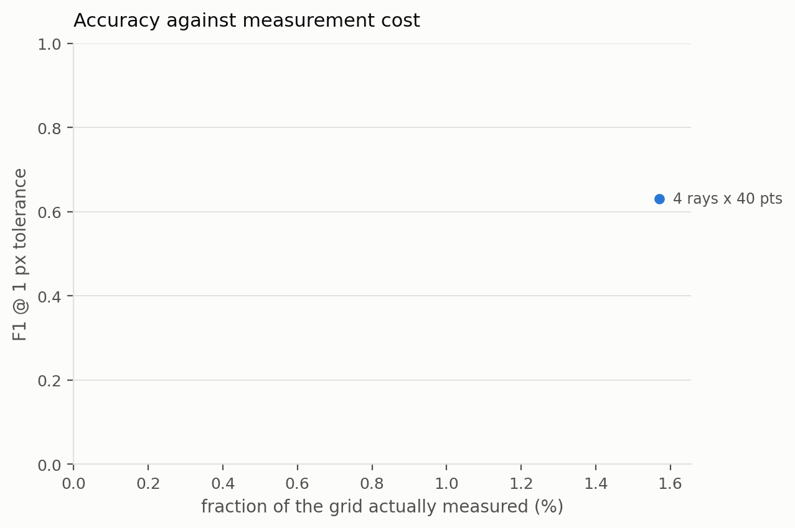
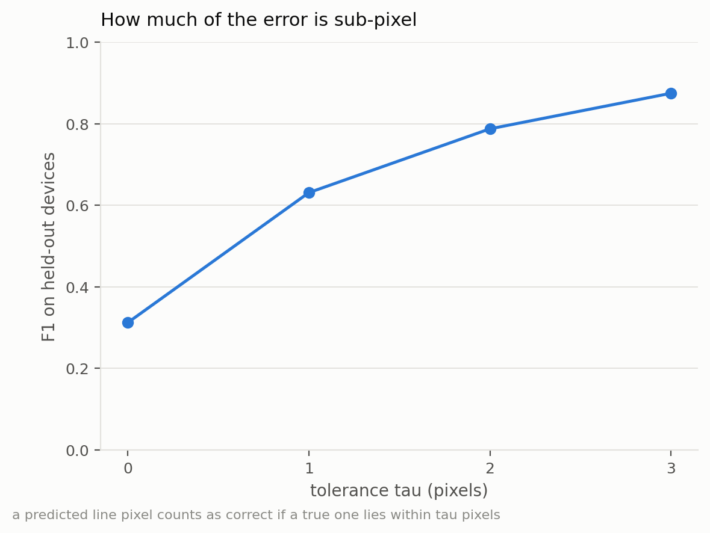

# probabilistic-csd-reconstruction

**Probabilistic reconstruction of charge stability diagrams from sparse ray
measurements.**

E. Alizadeh Kashtiban, T. Fujita, A. Oiwa — Osaka University
(Graduate School of Science and SANKEN).

A charge stability diagram (CSD) is normally acquired as a full raster scan of
the (V₁, V₂) plane, and the cost of that scan grows with the square of the
resolution. Here the plane is measured only along a **fan of rays** fired from
one corner of the window. A ray crossing a charge-transition line produces a
local maximum in the charge-sensor current, so the traces along the rays carry
sparse evidence of where the lines are. A small U-Net turns those traces into
a **per-pixel probability** that a transition line passes through each pixel of
the whole plane.

Two properties distinguish the output from an image reconstruction: it is a
**calibrated probability map**, not a picture, and the **threshold** that turns
it into lines is itself a reported quantity, chosen out-of-sample on a
validation split carved out of the training devices.

## Install

```bash
git clone https://github.com/<user>/probabilistic-csd-reconstruction
cd probabilistic-csd-reconstruction
pip install -r requirements.txt        # or:  pip install -e .
```

Python ≥ 3.10. Runs on CPU; CUDA is used automatically when available.

## Run the study

```bash
python scripts/run_0_full_sweep.py
```

That is the whole pipeline in one command: simulate the devices, cut the ray
measurements, train, score on held-out devices, and write the comparison
table and figures into `results/<run name>/`. The measurement budget, the
dataset sizes and the number of epochs are the settings block at the top of
that file.

Step by step — the normal way to work — is documented in
**[`scripts/README.md`](scripts/README.md)**:

```bash
python scripts/run_1_generate_dataset.py   # simulate the devices, split them
python scripts/run_2_train_model.py        # train the U-Net
python scripts/run_3_evaluate_model.py     # score it on held-out devices
python scripts/run_4_compare_configs.py    # every budget side by side
python scripts/run_5_render_device_figures.py
python scripts/run_6_threshold_report.py   # probability maps + threshold
python scripts/run_7_benchmarking.py       # geometry ablation
python scripts/run_8_device_gallery.py     # contact sheets of every device
python scripts/run_9_update_readme.py      # rewrite the Results section below
```

<!-- RESULTS:BEGIN -->

<!-- Generated by scripts/run_9_update_readme.py — do not edit by hand. -->

## Results

From `results/4_rays_40_points_300_samples/`, regenerated on 2026-09-19. 1 measurement budget, 300 training and 50 held-out devices (disjoint by device ID, seed 12345), 100 × 100 px diagrams.

### Every budget

| budget | coverage | F1@1 | precision | recall | IoU | threshold |
|---|---|---|---|---|---|---|
| 4 × 40 | 1.57 % | 0.631 | 0.538 | 0.789 | 0.187 | 0.40 |

The threshold is not 0.5 and is not tuned on the test devices: it is chosen on a validation split carved out of the training devices and stored in the checkpoint.

### Tolerance sweep — 4 rays × 40 points

| τ | precision | recall | F1@τ | coverage@τ |
|---|---|---|---|---|
| 0 | 0.213 | 0.613 | 0.312 | 1.57 % |
| **1** | 0.538 | 0.789 | **0.631** | 7.61 % |
| 2 | 0.729 | 0.877 | 0.787 | 16.13 % |
| 3 | 0.835 | 0.934 | 0.874 | 25.03 % |

`coverage@τ` is how far the measurement itself reaches at that tolerance: the fraction of the plane within τ pixels of a measured pixel. At τ = 0 it is the plain coverage, 1.57 %. Read the two columns together — a tolerant score is only evidence of recovery while the tolerance stays small against the plane.

Per-device spread at this budget: F1@1 mean 0.631, sd 0.132, min 0.187, max 0.803 over 50 held-out devices. Strict IoU is 0.187: one-pixel-wide lines are punished hard by IoU, and it is reported rather than hidden. Pixel accuracy is not reported as a result — predicting no line anywhere already scores 92.9 %.



*F1@1 against the fraction of the plane measured, for every budget in the run.*



*How the score depends on the tolerance &tau; — how much of the remaining error is sub-pixel placement rather than a missed line.*

<!-- RESULTS:END -->

## Layout

```
scripts/            the programs you run — a settings block and a few lines each
src/csdrecon/       the library.  Nothing here has a command line.
    config/         parameter space, paths, figure house style
    simulation/     the device model (QArray, constant-capacitance)
    ml/             the ray cutting, the U-Net, training, metrics
    study/          the pipeline stages, the sweep, the figure gallery
    visualization/  drawing measurements and predictions over a diagram
tests/              metric tests — `pytest -q`, no data or model needed
docs/figures/       the figures shown in this README (copied from a run)
data/               simulated device pools (generated; not in git)
results/            one folder per run: datasets, models, scores (not in git)
```

## Method

| | |
|---|---|
| **Simulator** | QArray, constant-capacitance model. QD₁ and QD₂ on plunger gates coupled through C_m; a third dot is the charge sensor. Capacitances are drawn at random per device. The ground truth is the exact charge-state boundary from the simulator, not an edge-detected image. Noise-free. |
| **Window** | a 2 × 2 mV window, randomly offset per device by up to 0.35 of its width, so the honeycomb is not phase-locked to a common origin. 100 × 100 px. |
| **Measurement** | `n_rays × n_points` samples along rays from one corner. Rays are oblique, so one ray crosses both families of honeycomb edges. |
| **Network input** | 2 channels: the raw sensor value where a ray passed, and a visited mask, so "measured and low" is distinguishable from "never measured". |
| **Network** | fully convolutional U-Net, depth 3 (32→64→128, bottleneck 256), sigmoid head → one probability per pixel. |
| **Loss** | BCEWithLogits with the positive class weighted by its rarity (capped at 8) + soft Dice. Adam 1e-3, batch 16. |
| **Metric** | tolerant **F1@τ**: a predicted pixel counts when a true line pixel lies within τ, and vice versa. τ = 0…3 are all reported; τ = 1 is the headline. Pixel accuracy is reported only to be dismissed — predicting nothing already scores ≈ 93 %. |

## Tests

```bash
pip install pytest && pytest -q
```

Nine checks on the metric the study is reported in — that a one-pixel offset
scores zero at τ = 0 and one at τ = 1, that an empty prediction is not
rewarded, that scores are averaged per device. They need no data, no model
and no simulator, and run in under a second.
