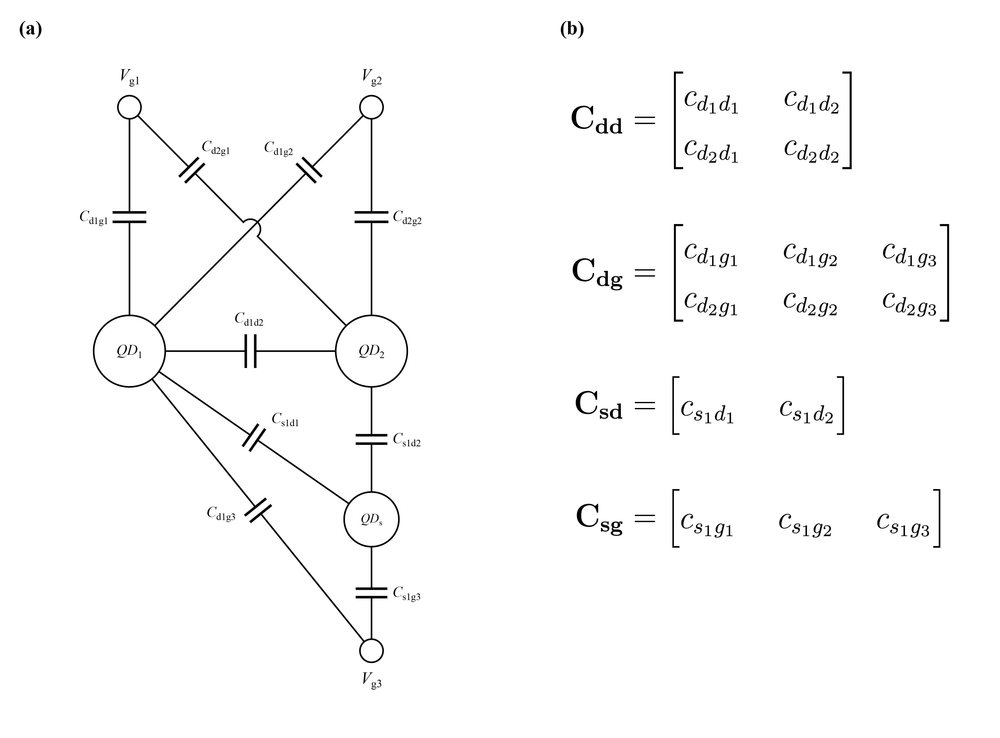
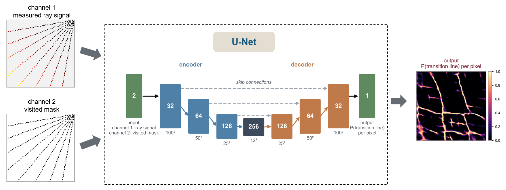

# probabilistic-csd-reconstruction

**Probabilistic reconstruction of charge stability diagrams from sparse ray
measurements.**

E. Alizadeh Kashtiban, T. Fujita, A. Oiwa — Osaka University
(Graduate School of Science and SANKEN).



*The simulated device and the parameters it is drawn from. **(a)** the
constant-capacitance network of the double dot with its charge sensor: each
plunger gate couples to its own dot (C_d1g1, C_d2g2) and, more weakly, to the
other (C_d2g1, C_d1g2); the dots are coupled by C_d1d2, and the sensor dot
QD_s couples to both dots and to its own gate V_g3. **(b)** the model's four
capacitance matrices; every entry is drawn independently and uniformly per
device. The ranges are in `src/csdrecon/config/capacitance_config.py`.*

A charge stability diagram (CSD) is normally acquired as a full raster scan of
the (V₁, V₂) plane, and the cost of that scan grows with the square of the
resolution. Here the plane is measured only along a **fan of rays** fired from
one corner of the window. A ray crossing a charge-transition line produces a
local maximum in the charge-sensor current, so the traces along the rays carry
sparse evidence of where the lines are. A small U-Net turns those traces into
a **per-pixel probability** that a transition line passes through each pixel of
the whole plane.

Two properties distinguish the output from an image reconstruction: it is a
**calibrated probability map**, not a picture, and the **threshold** that turns
it into lines is itself a reported quantity, chosen out-of-sample on a
validation split carved out of the training devices.

## Install

```bash
git clone https://github.com/<user>/probabilistic-csd-reconstruction
cd probabilistic-csd-reconstruction
pip install -r requirements.txt        # or:  pip install -e .
```

## Run the study

```bash
python scripts/run_0_full_sweep.py
```

That is the whole pipeline in one command: simulate the devices, cut the ray
measurements, train, score on held-out devices, and write the comparison
table and figures into `results/<run name>/`. The measurement budget, the
dataset sizes and the number of epochs are the settings block at the top of
that file.

Step by step — the normal way to work — is documented in
**[`scripts/README.md`](scripts/README.md)**:

```bash
python scripts/run_1_generate_dataset.py   # simulate the devices, split them
python scripts/run_2_train_model.py        # train the U-Net
python scripts/run_3_evaluate_model.py     # score it on held-out devices
python scripts/run_4_compare_configs.py    # every budget side by side
python scripts/run_5_render_device_figures.py
python scripts/run_6_threshold_report.py   # probability maps + threshold
python scripts/run_7_benchmarking.py       # geometry ablation
python scripts/run_8_device_gallery.py     # contact sheets of every device
python scripts/run_9_update_readme.py      # rewrite the Results section below
```

<!-- RESULTS:BEGIN -->

<!-- Generated by scripts/run_9_update_readme.py — do not edit by hand. -->

## Results

From `results/4-5-6-7-8_rays_40-50-60_points_500_samples/`. 15 measurement budgets, 500 training and 50 held-out devices (disjoint by device ID, seed 12345), 100 × 100 px diagrams.

### Every budget

| budget | coverage | F1@1 | precision | recall | IoU | threshold |
|---|---|---|---|---|---|---|
| 4 × 40 | 1.57 % | 0.660 | 0.617 | 0.719 | 0.204 | 0.60 |
| 5 × 40 | 1.94 % | 0.701 | 0.625 | 0.813 | 0.225 | 0.60 |
| 6 × 40 | 2.33 % | 0.735 | 0.683 | 0.804 | 0.238 | 0.40 |
| 7 × 40 | 2.72 % | 0.747 | 0.700 | 0.818 | 0.253 | 0.30 |
| 8 × 40 | 3.11 % | 0.784 | 0.748 | 0.831 | 0.275 | 0.60 |
| 4 × 50 | 1.95 % | 0.683 | 0.628 | 0.758 | 0.215 | 0.50 |
| 5 × 50 | 2.44 % | 0.736 | 0.709 | 0.773 | 0.250 | 0.70 |
| 6 × 50 † | 2.94 % | 0.427 | 0.320 | 0.739 | 0.107 | 0.40 |
| 7 × 50 | 3.42 % | 0.738 | 0.696 | 0.796 | 0.252 | 0.70 |
| **8 × 50** | 3.88 % | 0.796 | 0.786 | 0.815 | 0.295 | 0.70 |
| 4 × 60 | 2.35 % | 0.670 | 0.623 | 0.736 | 0.214 | 0.60 |
| 5 × 60 † | 2.96 % | 0.431 | 0.326 | 0.727 | 0.108 | 0.40 |
| 6 × 60 | 3.52 % | 0.772 | 0.732 | 0.822 | 0.272 | 0.60 |
| 7 × 60 † | 4.10 % | 0.432 | 0.324 | 0.737 | 0.108 | 0.40 |
| 8 × 60 † | 4.66 % | 0.445 | 0.331 | 0.735 | 0.112 | 0.40 |

† 4 of these 15 trainings did not converge — they never left their initial plateau, reaching a best validation F1@1 near 0.42 where every other run here reaches at least 0.66. Those rows are the score of a failed fit, not of the measurement budget. They are listed rather than dropped so the gap in the sweep is visible; re-running those budgets is enough to fill them in.

The threshold is not 0.5 and is not tuned on the test devices: it is chosen on a validation split carved out of the training devices and stored in the checkpoint.

### Tolerance sweep — 8 rays × 50 points

| τ | precision | recall | F1@τ | coverage@τ |
|---|---|---|---|---|
| 0 | 0.372 | 0.575 | 0.449 | 3.88 % |
| **1** | 0.786 | 0.815 | **0.796** | 17.85 % |
| 2 | 0.910 | 0.884 | 0.892 | 32.33 % |
| 3 | 0.952 | 0.921 | 0.931 | 45.91 % |

`coverage@τ` is how far the measurement itself reaches at that tolerance: the fraction of the plane within τ pixels of a measured pixel. At τ = 0 it is the plain coverage, 3.88 %. Read the two columns together — a tolerant score is only evidence of recovery while the tolerance stays small against the plane.

Per-device spread at this budget: F1@1 mean 0.796, sd 0.154, min 0.142, max 0.932 over 50 held-out devices. Strict IoU is 0.295: one-pixel-wide lines are punished hard by IoU, and it is reported rather than hidden. Pixel accuracy is not reported as a result — predicting no line anywhere already scores 92.9 %.

<!-- RESULTS:END -->

## Method



*Two input channels on the 100 × 100 grid — the sensor value at
ray-visited pixels, and the binary visited mask — through a depth-3
U-Net (32 → 64 → 128, 256-channel bottleneck; 100² → 50² → 25² → 12²,
skip connections) to a sigmoid head returning P(transition line) per
pixel over the whole plane, measured or not.*

| | |
|---|---|
| **Simulator** | QArray, constant-capacitance model. QD₁ and QD₂ on plunger gates coupled through C_m; a third dot is the charge sensor. Capacitances are drawn at random per device. The ground truth is the exact charge-state boundary from the simulator, not an edge-detected image. Noise-free. |
| **Window** | a 2 × 2 mV window, randomly offset per device by up to 0.35 of its width, so the honeycomb is not phase-locked to a common origin. 100 × 100 px. |
| **Measurement** | `n_rays × n_points` samples along rays from one corner. Rays are oblique, so one ray crosses both families of honeycomb edges. |
| **Network input** | 2 channels: the raw sensor value where a ray passed, and a visited mask, so "measured and low" is distinguishable from "never measured". |
| **Network** | fully convolutional U-Net, depth 3 (32→64→128, bottleneck 256), sigmoid head → one probability per pixel. |
| **Loss** | BCEWithLogits with the positive class weighted by its rarity (capped at 8) + soft Dice. Adam 1e-3, batch 16. |
| **Metric** | tolerant **F1@τ**: a predicted pixel counts when a true line pixel lies within τ, and vice versa. τ = 0…3 are all reported. |

## Tests

```bash
pip install pytest && pytest -q
```

Nine checks on the metric the study is reported in — that a one-pixel offset
scores zero at τ = 0 and one at τ = 1, that an empty prediction is not
rewarded, that scores are averaged per device. They need no data, no model
and no simulator, and run in under a second.
