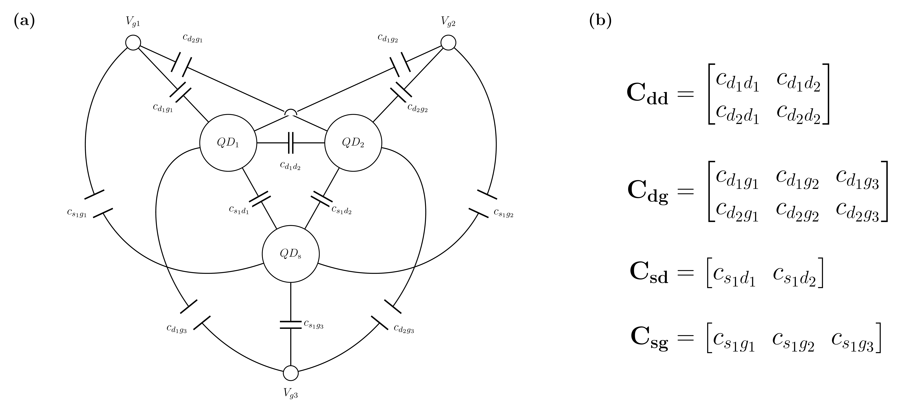
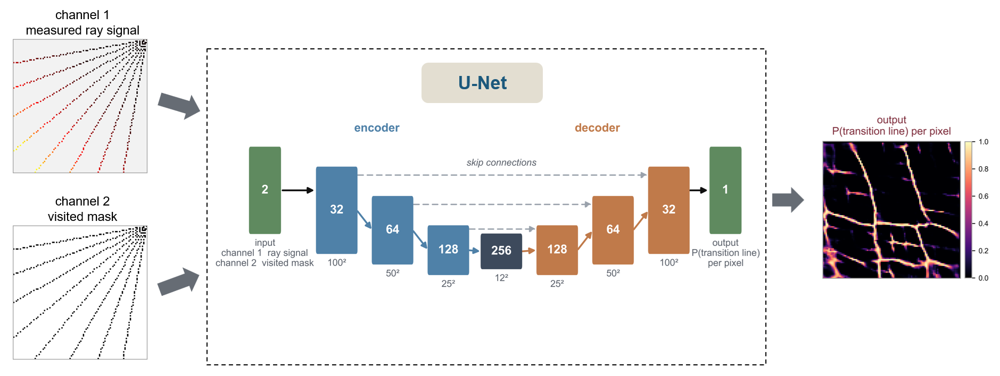

# probabilistic-csd-reconstruction

**Probabilistic reconstruction of charge stability diagrams from sparse ray
measurements.**

E. Alizadeh Kashtiban, T. Fujita, A. Oiwa — Osaka University
(Graduate School of Science and SANKEN).



*The constant-capacitance model of the simulated device (Fig. 1 of the
paper). **(a)** The capacitor network: two quantum dots QD₁ and QD₂, a
sensor dot QD_s, and three gates. **(b)** The four capacitance matrices that
define a device. A device is one uniform draw of the 14 free parameters
listed below.*

### The constant-capacitance model

Each simulated device is a double quantum dot (DQD) capacitively coupled to
a single charge sensor, modelled with the QArray simulator in the
constant-capacitance approximation: the device is a network of fixed
capacitors, and for a gate-voltage vector V_g the ground-state charge
configuration n = (n₁, n₂) is the integer occupation that minimises the
electrostatic energy of the network. The transition lines of the stability
diagram are where two charge configurations are degenerate.

Each of the three islands (two dots and the sensor) couples to each of the
three gates — nine branches — and the islands couple to one another through
c_d1d2, c_s1d1 and c_s1d2 — three more, twelve drawn in (a). The
self-capacitances c_d1d1 and c_d2d2 are not drawn, so a device is specified
by **14 capacitances**, collected into four matrices: C_dd (2 × 2,
symmetric, so c_d1d2 = c_d2d1), C_dg (2 × 3), C_sd (1 × 2) and C_sg
(1 × 3). Every entry is drawn independently and uniformly from its interval,
in QArray's dimensionless capacitance units:

| matrix | entry | interval |
|---|---|---|
| C_dd | c_d1d1 | 0.30 – 1.40 |
| C_dd | c_d2d2 | 0.30 – 1.40 |
| C_dd | c_d1d2 | 0.20 – 2.00 |
| C_dg | c_d1g1 | 0.80 – 6.00 |
| C_dg | c_d2g2 | 0.80 – 6.00 |
| C_dg | c_d1g2 | 0.05 – 0.60 |
| C_dg | c_d2g1 | 0.05 – 0.60 |
| C_dg | c_d1g3 | 0.01 – 0.10 |
| C_dg | c_d2g3 | 0.01 – 0.10 |
| C_sd | c_s1d1 | 0.02 – 0.15 |
| C_sd | c_s1d2 | 0.02 – 0.15 |
| C_sg | c_s1g1 | 0.02 – 0.10 |
| C_sg | c_s1g2 | 0.02 – 0.10 |
| C_sg | c_s1g3 | 0.10 – 1.00 |

No sampled device is filtered or rejected. Training and test devices are
drawn from the same intervals and are separated by device identity only.
The intervals are `DEFAULT_INTERVALS` in
`src/csdrecon/config/capacitance_config.py`; this table is that dictionary.

A charge stability diagram (CSD) is normally acquired as a full raster scan of
the (V₁, V₂) plane, and the cost of that scan grows with the square of the
resolution. Here the plane is measured only along a **fan of rays** fired from
one corner of the window. A ray crossing a charge-transition line produces a
local maximum in the charge-sensor current, so the traces along the rays carry
sparse evidence of where the lines are. A small U-Net turns those traces into
a **per-pixel probability** that a transition line passes through each pixel of
the whole plane.

Two properties distinguish the output from an image reconstruction: it is a
**probability map** of the transition lines, not a picture of the sensor
signal, and the **threshold** that turns it into lines is itself a reported
quantity, chosen out-of-sample on a validation split carved out of the
training devices. Whether the probabilities are calibrated has not been
tested.

## Install

```bash
git clone https://github.com/Ehsan-Japan/probabilistic-csd-reconstruction
cd probabilistic-csd-reconstruction
pip install -r requirements.txt        # or:  pip install -e .
```

## Run the study

```bash
python scripts/run_0_full_sweep.py
```

That is the whole pipeline in one command: simulate the devices, cut the ray
measurements, train, score on held-out devices, and write the comparison
table and figures into `results/<run name>/`. The measurement budget, the
dataset sizes and the number of epochs are the settings block at the top of
that file.

Step by step — the normal way to work — is documented in
**[`scripts/README.md`](scripts/README.md)**:

```bash
python scripts/run_1_generate_dataset.py   # simulate the devices, split them
python scripts/run_2_train_model.py        # train the U-Net
python scripts/run_3_evaluate_model.py     # score it on held-out devices
python scripts/run_4_compare_configs.py    # every budget side by side
python scripts/run_5_render_device_figures.py
python scripts/run_6_threshold_report.py   # probability maps + threshold
python scripts/run_9_update_readme.py      # rewrite the Results section below
```

<!-- RESULTS:BEGIN -->

<!-- Generated by scripts/run_9_update_readme.py — do not edit by hand. -->

## Results

From `results/4-5-6-7-8_rays_40-50-60_points_500_samples/`. 15 measurement budgets, 500 training and 50 held-out devices (disjoint by device ID, seed 12345), 100 × 100 px diagrams.

### Every budget

| rays × points | coverage (%) | threshold | precision | recall | F1@0 | F1@1 |
|---|---|---|---|---|---|---|
| 4 × 40 | 1.57 | 0.6 | 0.617 | 0.719 | 0.335 | 0.660 |
| 5 × 40 | 1.94 | 0.6 | 0.625 | 0.813 | 0.363 | 0.701 |
| 6 × 40 | 2.33 | 0.4 | 0.683 | 0.804 | 0.378 | 0.735 |
| 7 × 40 | 2.72 | 0.3 | 0.700 | 0.819 | 0.396 | 0.747 |
| 8 × 40 | 3.11 | 0.6 | 0.748 | 0.830 | 0.426 | 0.783 |
| 4 × 50 | 1.95 | 0.5 | 0.628 | 0.758 | 0.350 | 0.683 |
| 5 × 50 | 2.44 | 0.7 | 0.709 | 0.773 | 0.394 | 0.736 |
| 6 × 50\* | 2.94 | 0.7 | 0.625 | 0.713 | 0.344 | 0.661 |
| 7 × 50 | 3.42 | 0.7 | 0.696 | 0.796 | 0.396 | 0.738 |
| 8 × 50 | 3.88 | 0.7 | 0.786 | 0.815 | 0.449 | 0.796 |
| 4 × 60 | 2.35 | 0.6 | 0.623 | 0.736 | 0.348 | 0.670 |
| 5 × 60\* | 2.96 | 0.5 | 0.674 | 0.809 | 0.393 | 0.731 |
| 6 × 60 | 3.52 | 0.6 | 0.732 | 0.822 | 0.422 | 0.772 |
| 7 × 60\* | 4.10 | 0.4 | 0.756 | 0.837 | 0.438 | 0.789 |
| **8 × 60**\* | 4.66 | 0.6 | 0.806 | 0.836 | 0.469 | **0.817** |

Budgets marked \* were retrained from a different random initialisation.

The threshold is not 0.5 and is not tuned on the test devices: it is chosen on a validation split carved out of the training devices and stored in the checkpoint.

### Tolerance sweep — 8 rays × 60 points

| τ | precision@τ | recall@τ | F1@τ | coverage@τ |
|---|---|---|---|---|
| 0 | 0.412 | 0.554 | 0.469 | 4.66 % |
| **1** | 0.806 | 0.836 | **0.817** | 18.91 % |
| 2 | 0.905 | 0.912 | 0.905 | 33.12 % |
| 3 | 0.947 | 0.950 | 0.946 | 47.37 % |

`coverage@τ` is how far the measurement itself reaches at that tolerance: the fraction of the plane within τ pixels of a measured pixel. At τ = 0 it is the plain coverage, 4.66 %. Read the two columns together — a tolerant score is only evidence of recovery while the tolerance stays small against the plane.

Per-device spread at this budget: F1@1 mean 0.817, sd 0.138, min 0.281, max 0.945 over 50 held-out devices. Pixel accuracy is not reported as a result — predicting no line anywhere already scores 92.9 %.

<!-- RESULTS:END -->

## Method



*Two input channels on the 100 × 100 grid — the sensor value at
ray-visited pixels, and the binary visited mask — through a depth-3
U-Net (32 → 64 → 128, 256-channel bottleneck; 100² → 50² → 25² → 12²,
skip connections) to a sigmoid head returning P(transition line) per
pixel over the whole plane, measured or not.*

| | |
|---|---|
| **Simulator** | QArray, constant-capacitance model (above): 14 capacitances per device, drawn uniformly from the intervals in the table. The ground truth is the exact charge-state boundary from the simulator, not an edge-detected image. Noise-free (NoNoise, nothing added afterwards). 550 devices: 500 training (75 of them validation), 50 held out. |
| **Window** | a 2 × 2 mV window, shifted at random per device by up to 35 % of its width along each axis, so the transition lines do not appear at fixed positions in the frame. 100 × 100 px. |
| **Measurement** | `n_rays × n_points` samples along rays from one corner. Rays are oblique, so one ray crosses both families of honeycomb edges. |
| **Network input** | 2 channels: the raw sensor value where a ray passed, and a visited mask, so "measured and low" is distinguishable from "never measured". |
| **Network** | fully convolutional U-Net, depth 3 (32→64→128, bottleneck 256), sigmoid head → one probability per pixel; 1 949 409 trainable parameters, the same for every budget. One model is trained per budget, 50 epochs, keeping the epoch with the best validation F1@1. |
| **Loss** | BCEWithLogits with the positive class weighted by its rarity (capped at 8) + soft Dice. Adam 1e-3, batch 16. |
| **Metric** | tolerant **F1@τ**: a predicted pixel counts when a true line pixel lies within τ, and vice versa. τ = 0…3 are all reported. |

## Tests

```bash
pip install pytest && pytest -q
```

25 checks, among them the metric the study is reported in — that a
one-pixel offset scores zero at τ = 0 and one at τ = 1, that an empty
prediction is not rewarded, that scores are averaged per device — and that
this README's results section cannot go stale or mark a converged training
as failed. They need no data, no model and no simulator, and run in a few
seconds.
